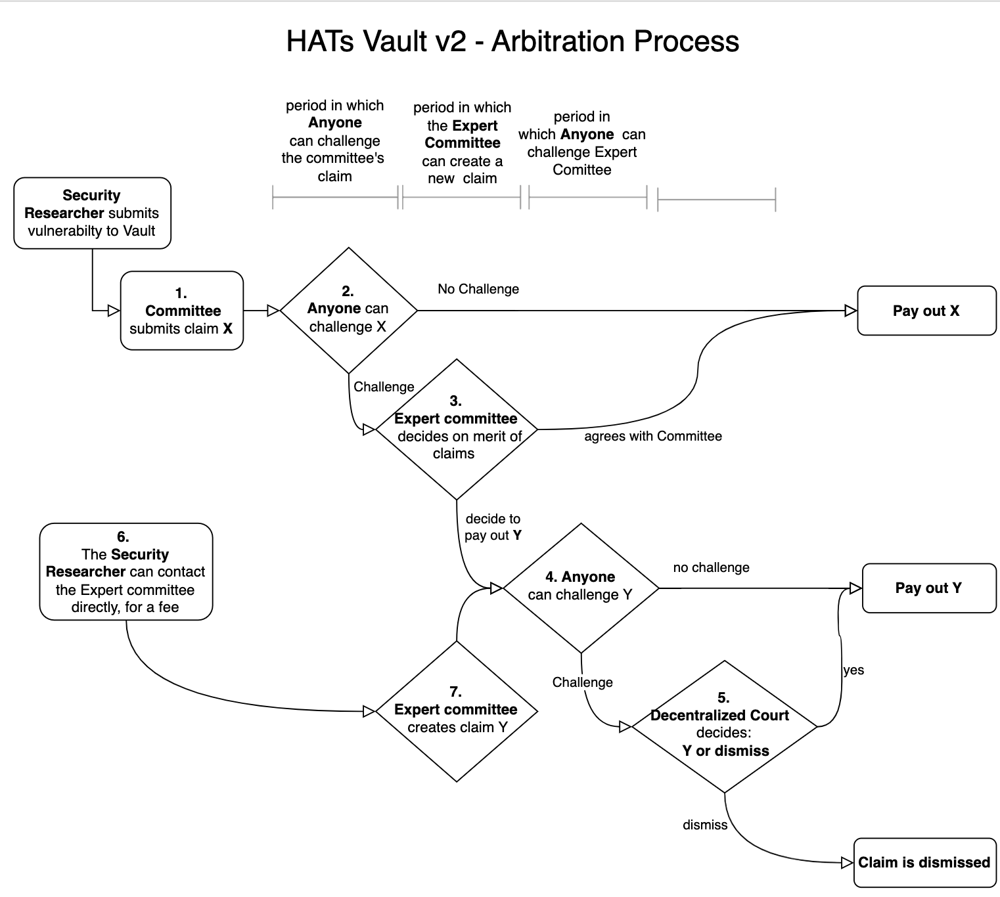

# Submission and arbitration of claims for bounty payouts

.

## Actors

1. A *security researcher* is an individual that has found a vulnerability in the code covered by the Vault's description
1. A vault's *committee* is a group of experts. The committee is chosen by the creators of the Vault, and is responsible for evaluating the reports submitted by security researchers
1. The vault's *arbitrator* is an independent instance that functions as a mediator in case there is a disagreement on the committee's evaluation. 

## Overview of the process

1. A **security researcher** communicates the vulnerability via a private channel to the **committee**. HATs.finance provides tools for this (https://app.hats.finance/vulnerability)
1. The **committee** evaluates the claim and takes any necessary action to limit the damage caused by the vulnerability (for example by deploying a fix). 
1. The committee then *submits a claim* on-chain, specifying the beneficiary and the size of the payout. 
1. A challenge period starts, in which the arbitrator contract can challenge the claim
3. If nobody challenges the claim during the challenge period, the claim is paid out as set by the committee
4. If the claim is challenged, then the `arbitrator` can choose to either dismiss the claim, or to approve it. On some vaults, the arbitrator is allowed to change bounty percentage as well.
5. If the arbitrator does not approve or dismiss a challenged claim, then after a dispute period, the claim is automatically dismissed (this is a safeguard if for some reason the aribtrator becomes unavailable)
6. If any of these processes times out due to inactivity, the claim is dismissed

## The arbitrator

In Hats v2, we created a generic arbitration procedure in case some party does not agree with the size of the bounty assigned by the Committee.

Claims can be disputed via an `arbitrator` contract, which implements a dispute mechanism.  The `arbitrator` can pause the payout of the claim until he resolves the dispute. Hats finance provides a default arbitration procedure, but single vaults can override this procedure by choosing a different arbitration contract.

The arbitrator can be any contract. By default, it is a multisig controlled by independent experts appointed by HATs.finance. We are currently in the process of creating other arbitration contracts to integrate with Kleros and UMA.

## Details and restrictions

There are 3 "periods" relevant for the handling of a new claim:
1. Challenge Period: the first `challengePeriod` seconds after the submission of the claim 
1. Challenge Timeout Period: the `challengeTimeOutPeriod` seconds after the challenge period ended
1. Expiration: after `challengePeriod + challengeTimeoutPeriod` seconds after the submission of the claim

The whole flow from submission of a vulnerability up to payout (or dismissal) of the claim then works as follows:

### SUBMISSION

  `submitClaim(beneficiary, bountyPercentage)` will create a new `claimId`.
   - `submitClaim` can only be called by the committee
   - `submitClaim` can only be called in a *safety period*
   - `submitClaim` can only be called if no other active claim exists
   - emergencyPause must not be in effect

### CHALLENGE 
 
 `challengeClaim(_claimId)` 
   - can only be called during the challenge period
   - only the `arbitrator` or the `registry.owner` can challenge a claim (the registry.owner functions here as a "challenger of last resort")
   - can only be called if the claim has not been challenged yet

### APPROVAL

`approveClaim(_claimId, bountyPercentage)`
  - if the challenge period had passed and the claim was not challenged, anyone can call `approveClaim` and approve the claim. In that case, the bountyPercentage remains that as chosen by the committee
  - if the claim is challenged (during the challenge period), and no more than `challengeTimeoutPeriod` seconds have passed since the challenge, the `arbitrator` can call `approveClaim`. The arbitrator can change the bountyPercentage if given the permission

[More details about the payout are here](./payout.md)

###  DISMISSAL

`dismissClaim(_claimId)`
    - during the challenge period and challenge timeout period:
      - if the claim was challenged, the arbitrator can dismiss the claim
    - after challengePeriod + challengeTimeoutPeriod, the claim is _expired_  and:
      - anyone can dismiss the claim

During the time from submitting a claim to its resolution (i.e. approval or dismissal), the vault will be locked for withdrawals, and no new claims can be submitted

## Relevant settings

- `challengePeriod`: length of challlenge period, in seconds
- `challengeTimeoutPeriod`: length of time a challenged claim can be approved
- `arbitratorCanChangeBounty`: determines whether the arbitrator can change the bounty percentage when approving a claim